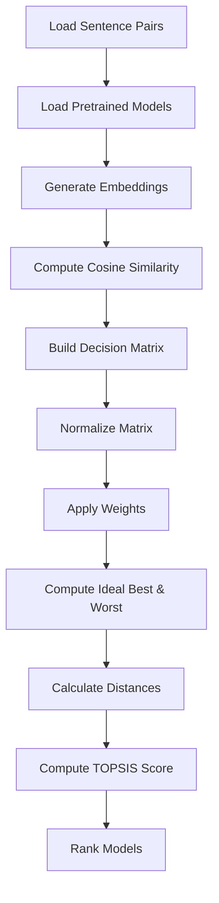

# 📊 TOPSIS-Based Evaluation of Sentence Similarity Models

## 🚀 Project Overview

This project evaluates multiple Hugging Face pre-trained sentence embedding models using the **TOPSIS (Technique for Order Preference by Similarity to Ideal Solution)** multi-criteria decision-making method.

The objective is to rank sentence similarity models based on:

- Semantic Accuracy
- Inference Speed
- Model Size
- Embedding Dimension
- Cosine Similarity

---

# 🎯 Problem Statement

Select the best sentence similarity model using multiple performance and efficiency criteria.

Instead of evaluating only accuracy, this project ensures balanced model selection using TOPSIS.

---

# 🧠 Sentence Pairs Used

```python
sentence_pairs = [
    ("Machine learning is a subset of artificial intelligence.",
     "Artificial intelligence includes machine learning as one of its parts."),

    ("Deep learning models require large amounts of data.",
     "Neural networks perform better when trained with more data."),

    ("The stock market fluctuates daily.",
     "Neural networks are used in computer vision.")
]
```
# 🤖 Models Compared

sentence-transformers/all-MiniLM-L6-v2

sentence-transformers/paraphrase-MiniLM-L12-v2

sentence-transformers/all-mpnet-base-v2

intfloat/e5-base-v2

BAAI/bge-base-en-v1.5

| Criteria Name            | Type (Benefit / Cost) | Weight | Description                                 | Why It Matters                                           |
| ------------------------ | --------------------- | ------ | ------------------------------------------- | -------------------------------------------------------- |
| STS Score                | Benefit               | 0.30   | Benchmark semantic textual similarity score | Measures how well the model understands sentence meaning |
| Inference Time (seconds) | Cost                  | 0.20   | Time taken to generate embeddings           | Faster models are better for real-time applications      |
| Model Size (MB)          | Cost                  | 0.20   | Memory required by the model                | Smaller models are easier to deploy                      |
| Embedding Dimension      | Cost                  | 0.10   | Length of output vector                     | Higher dimensions increase computation and storage       |
| Cosine Similarity        | Benefit               | 0.20   | Similarity score between test sentences     | Reflects semantic closeness between sentences            |

# 🧮 TOPSIS Methodology

The Technique for Order Preference by Similarity to Ideal Solution (TOPSIS) ranks alternatives based on their distance from an ideal best and ideal worst solution.

---

## Step 1: Construct Decision Matrix

Let the decision matrix be:

$$
X = [x_{ij}]
$$

where:
- $i = 1,2,...,m$ (alternatives)
- $j = 1,2,...,n$ (criteria)

---

## Step 2: Normalize the Decision Matrix

Each element is normalized as:

$$
R_{ij} = \frac{x_{ij}}{\sqrt{\sum_{i=1}^{m} x_{ij}^{2}}}
$$

---

## Step 3: Construct Weighted Normalized Matrix

$$
V_{ij} = w_j \times R_{ij}
$$

where:
- $w_j$ = weight of criterion $j$
- $\sum_{j=1}^{n} w_j = 1$

---

## Step 4: Determine Ideal Best and Ideal Worst

For benefit criteria:

$$
V_j^{+} = \max(V_{ij})
$$

$$
V_j^{-} = \min(V_{ij})
$$

For cost criteria:

$$
V_j^{+} = \min(V_{ij})
$$

$$
V_j^{-} = \max(V_{ij})
$$

---

## Step 5: Calculate Separation Measures

Distance from Ideal Best:

$$
D_i^{+} = \sqrt{\sum_{j=1}^{n} (V_{ij} - V_j^{+})^2}
$$

Distance from Ideal Worst:

$$
D_i^{-} = \sqrt{\sum_{j=1}^{n} (V_{ij} - V_j^{-})^2}
$$

---

## Step 6: Calculate Closeness Coefficient

$$
C_i = \frac{D_i^{-}}{D_i^{+} + D_i^{-}}
$$

where:

$$
0 \le C_i \le 1
$$

The alternative with the highest $C_i$ is ranked first.

# 🔁 Workflow Diagram

# 🏗️ Project Structure
```bash
topsis-similarity/
│
├── topsis-similarity.py
├── topsis_results.csv
├── ranking_plot.png
├── requirements.txt
└── README.md
```

#  Install Dependencies
```bash
Using requirements file:
pip install -r requirements.txt
```
```bash
Or install manually:
pip install sentence-transformers
pip install torch
pip install numpy
pip install pandas
pip install scikit-learn
pip install matplotlib
```
```bash
# Run the Project
python topsis-similarity.py
```

# 📂 Output Files
```bash
After execution:

topsis_results.csv → Final ranking results
ranking_plot.png → Visualization of ranking
```

#📈 Result Interpretation
```bash
The model with the highest TOPSIS score achieves the best trade-off between:

Accuracy
Speed
Efficiency
Embedding Quality

This ensures objective and balanced model comparison.
```
# 🏆 Conclusion

This project demonstrates how multi-criteria decision-making (TOPSIS) can objectively rank NLP models instead of relying on a single metric like accuracy.
The approach ensures balanced evaluation considering both performance and computational efficiency.

# 👨‍💻 Author

Sparsh
B.Tech Computer Science Engineering


